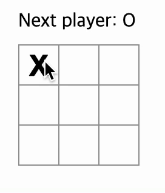

# Tic-Tac-Toe

소소하지만 확실한 행복의 첫번째 습작 틱택토 프로젝트

 
 

## 스터디 방법

구현사항 설계 -> TicTacToe 기능 개발 -> 페어를 정해 페어프로그래밍 진행 -> 코드리뷰 진행

 
 
## 페어현황

| 팀 / 이름 |            |
| --------- | ---------- |
| 1팀       | 정호, 나현 |
| 2팀       | 연진, 슬기 |
| 3팀       | 승훈, 나라 |

 
 

## 구현목표

Tic-Tac-Toe게임을 **React를** 사용하여 구현합니다.

 

### 구현예시

 

 
 

## 공통 구현사항

- [x] 빈 사각형 9개가 (3 \* 3) 존재한다.
- [x] 빈 사각형을 클릭하면 “O” 나 “X”가 표시된다.
  - [x] 한 번 클릭한 표시는 변할 수 없다.
  - [x] 처음 클릭은 “X”가 표시된다.
- [x] 클릭을 하여 “O” 또는 “X” 가 표시되었다면 그 다음 표시는 무조건 다른 모양이 표시된다.
  - [x] Next Player를 보여주며 다음 표시를 알려준다. (ex: Next Player: X)
- [x] 승리조건을 충족한다면 게임을 멈추고 승리자를 보여준다.
  - [x] 승리조건은 가로, 세로, 대각선을 포함하여 3개가 연속적으로 존재한다면 승리조건에 만족한다. (ex: Next player ⇒ Winner player로 변경)
  - [x] 승리자가 정해지면 더 이상 클릭 불가

## 추가 구현사항

- [ ] 이전에 진행했던 시점으로 돌아갈 수 있다.
  - [ ] 클릭을 했을 때 우측에 "Go to #~"가 표시된다.
    - [ ] "Go to #~"을 클릭한다면 해당 시점으로 돌아간다.
      - [ ] 클릭을 하기 전의 Square가 보여진다.
  - [ ] 승리자가 정해진다면 더 이상의 "Go to #~"는 생성되지 않는다.
- [ ] "O"와 "X"는 각각 다른 색깔로 표현된다.
  - [ ] "O"는 "Blue", "X"는 "Red"로 표시된다.
- [ ] 승리자가 정해진다면 "Restart"버튼이 생성된다.
  - [ ] "Restart"버튼을 누른다면 TicTacToe가 다시 시작한다.
- [ ]
